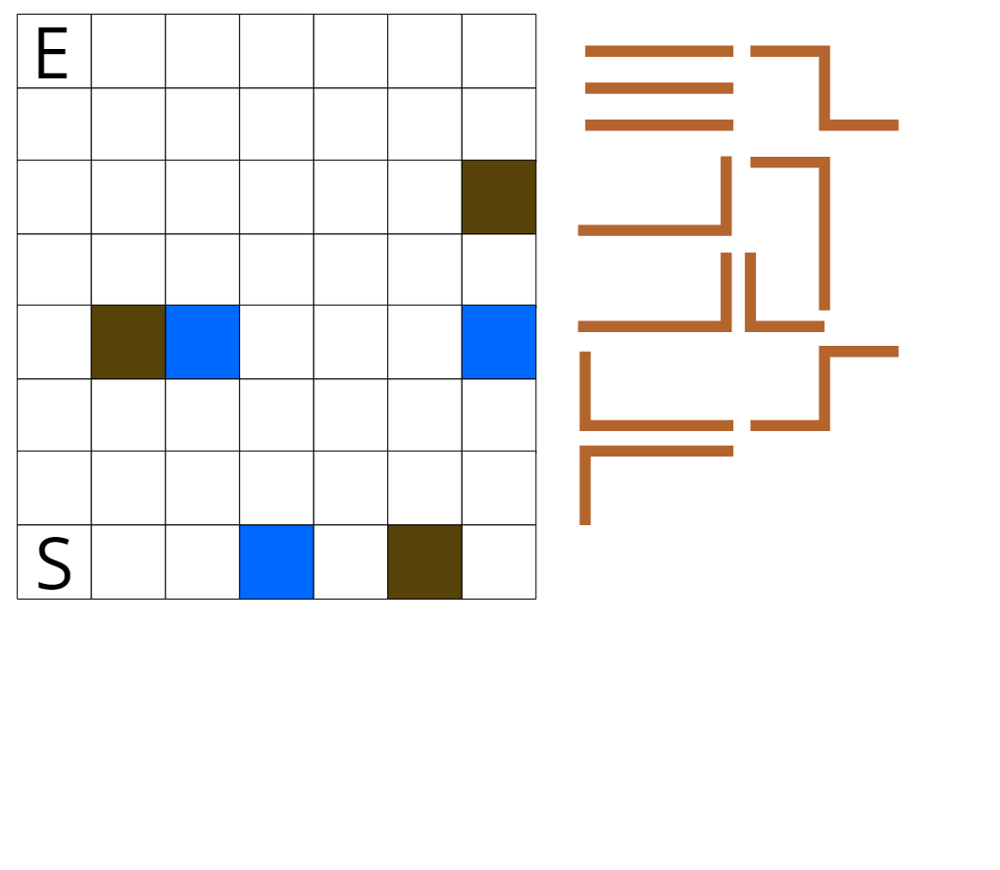
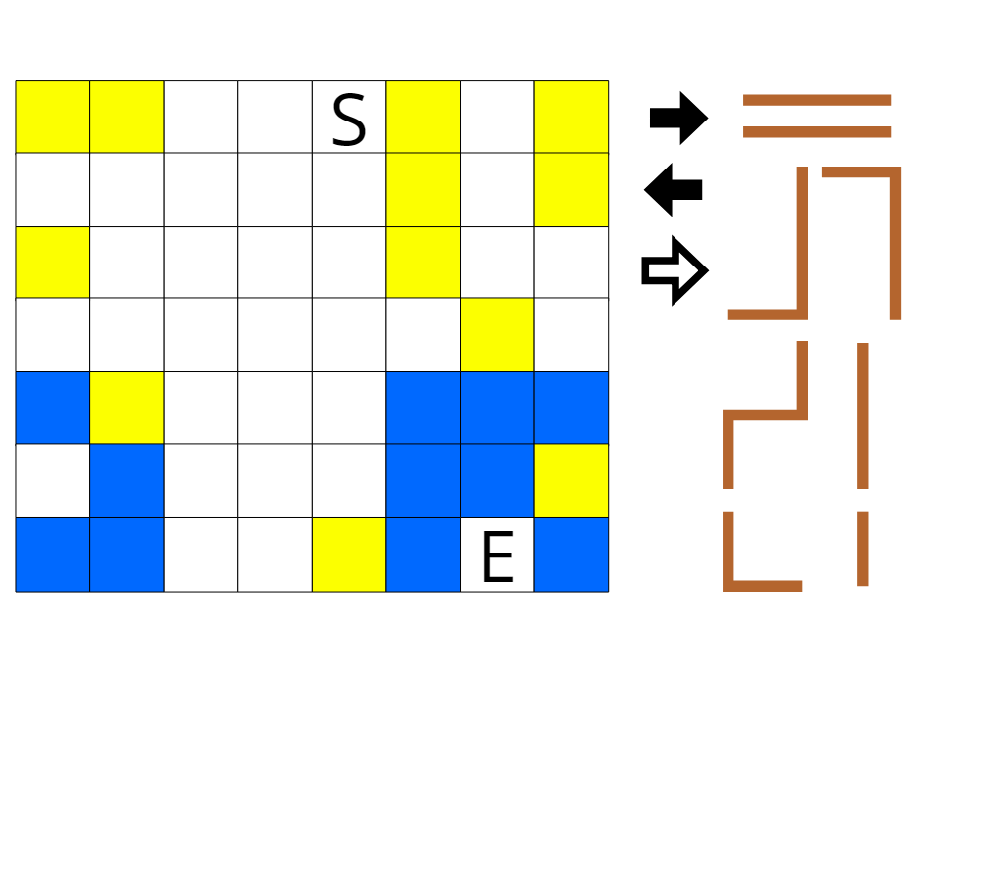

## 맵

### 스테이지 1
#### 레벨 1

#### 레벨 2

### 스테이지 2
#### 레벨 1

#### 레벨 2

불 5개
★★★: 모든 밧줄 사용 / 모든 장작 사용 / 불 1개 이상 보존
★★: 모든 밧줄 사용 / 불 5개 이상 보존
★: 불 1개 이상 보존
### 스테이지 3
#### 레벨 1

#### 레벨 2

불 5개
★★★: 모든 밧줄, 선풍기, 스프레이 사용 / 불 3개 이상 보존
★★: 모든 밧줄 사용 / 모든 선풍기, 스프레이 미사용 / 불 1개 이상 보존
★: 불 1개 이상 보존
