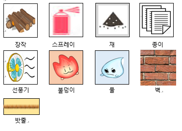
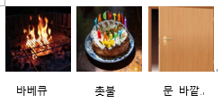
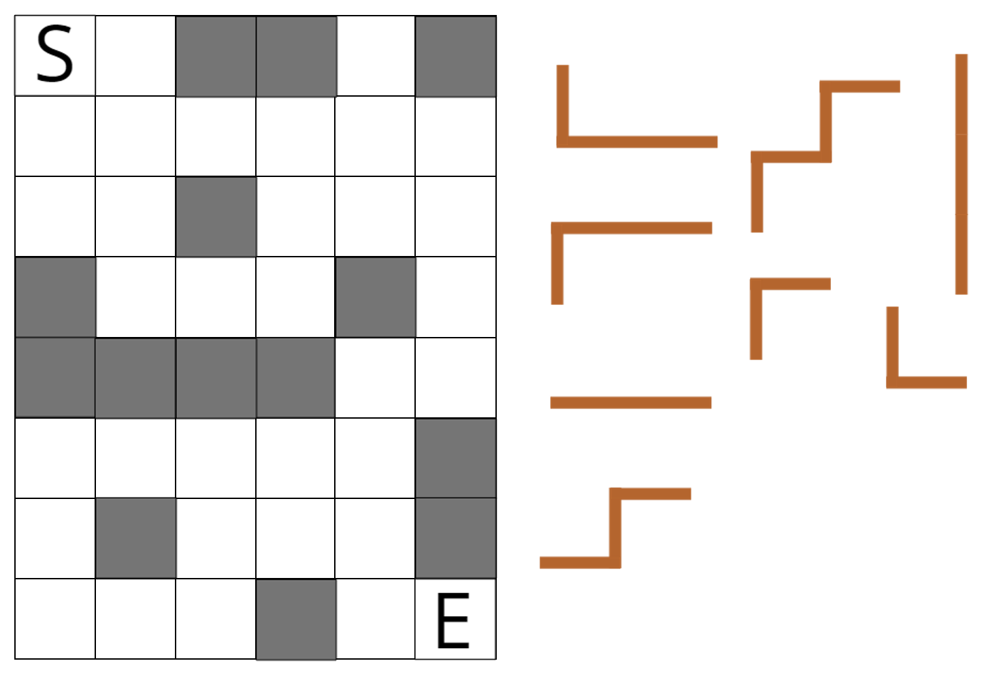
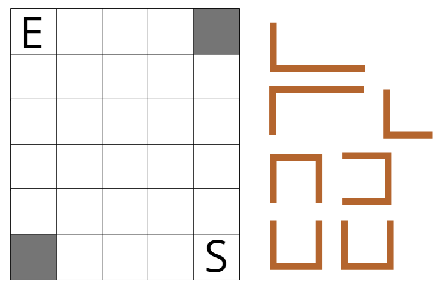
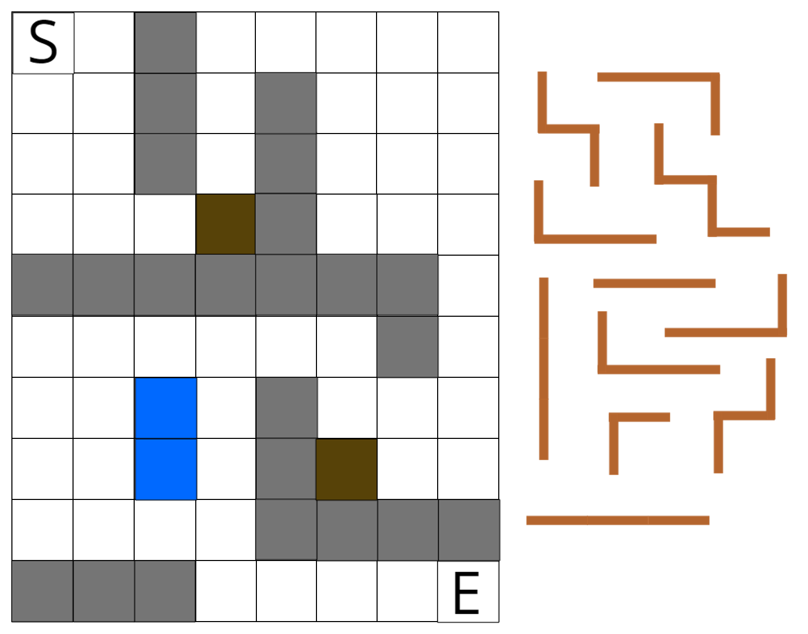
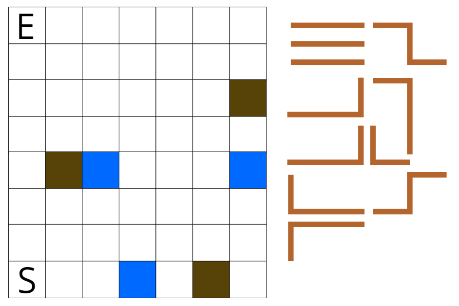
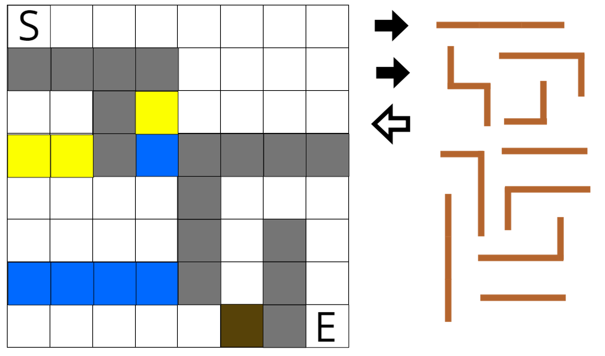
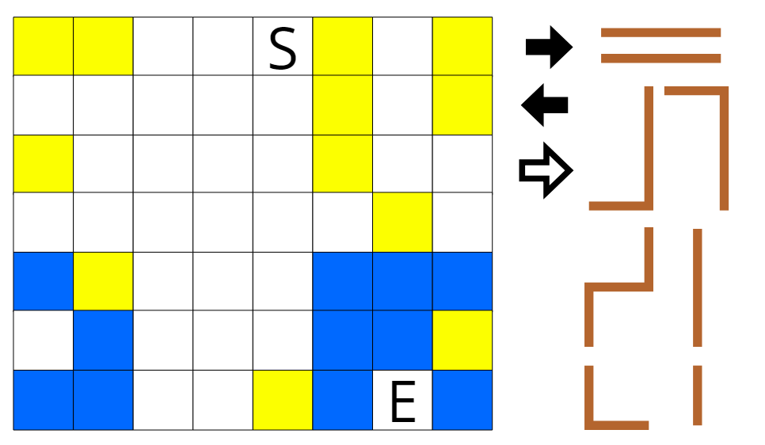

# Fire Rush 게임설명서

## 게임 시나리오

### 시놉시스
불이 필요한 사람들에게 불을 빌려주기 위해 불덩이(이름미정)들이 모험을 떠난다.

### 시나리오
급하게 불이 필요한 사람들이 곤란을 겪고 있다. 그 사람들에게 불을 빌려주기 위해 불덩이들이 모험을 떠난다. 하지만 이를 시샘하는 물덩이(이름미정)들이 불덩이들의 모험을 방해하기 위해 길을 막고있다. 당신은 주어진 도구들을 적재적소에 배치해 이 불덩이들이 무사히 사람들에게 도달하게 해야 한다.

## 스테이지 컨셉

### 배경컨셉 (도달지점)
1. 난로 (문) -- 불덩이, 밧줄, 골인지점, 벽
* [난로속 ~~~~ 문 바깥]
* 난로 밖의 사람들에게 도움을 주기 위해 불덩이들이 을 떠난다.
2. 정원 (바베큐) -- 물, 장작 추가 >>>>> (정원 도구)
* [현관문 ~~~~ 바베큐 그릴]
* 정원에서 바베큐를 즐기려던 사람들이 불이 없어서 곤란해 한다.
* 불덩이들은 현관문에서 바베큐 그릴까지 이동해야 한다.
3. 집안 (촛불) -- 종이, 선풍기, 스프레이 추가 >>>>> ( 사람들이 쓰는 도구)
* [집안 ~~~~~ 촛불]
* 아이의 생일을 축하하기 위해 생일 파티를 열려고 하는데 케이크 위의 촛불에 불을 붙일 수 없어서 곤란해한다.
* 불덩이들은 집 안에서 케이크 위의 촛불까지 도달 해야 한다.

## 일반 스테이지 맵

### 일반 스테이지 맵 구성
* 난로 스테이지
  * 불덩이, 밧줄, 골인지점, 벽 이 네가지로 구성되어 있는 난로 스테이지 맵
  * 위 네개의 구성물 말고는 나오지 않는다.
* 정원 스테이지
  * 물, 장작이 추가된 스테이지
  * 물과 장작이 추가되어 나올 수도 있고, 두개가 전부 나오지 않을 수도 있다.
* 집안 스테이지
  * 정원 스테이지에서 종이, 선풍기, 스프레이가 추가된 스테이지
  * 마찬가지로 세가지 모두 다 나올 수 도 있고, 다 나오지 않을 수도 있다.
* 맵의 크기는 최대 8 * 12 로 그려진다.
* 모든 오브젝트는 1 * 1 짜리인 한칸을 사용한다.
* 겹칠 수 있는 오브젝트도 있고, 겹치지 못하는 오브젝트도 있다.

## 튜토리얼  맵

### 튜토리얼 맵 구성
- 총 6개의 튜토리얼 스테이지로 구성되어 있다.
  - 밧줄 스테이지
  - 물 스테이지
  - 장작 스테이지
  - 종이 스테이지
  - 선풍기 스테이지
  - 스프레이 스테이지

* 각각의 스테이지는 4 * 4의 형식을 가지며, 각 스테이지마다, 오브젝트는 최대 3개 까지 있다.
  * 밧줄 스테이지는 불덩이를 이동 시키는 방법을 가르쳐 준다.
  * 물 스테이지는 불덩이가 물에 닿으면 어떻게 되는지 가르쳐 준다.
  * 장작 스테이지는 불덩이가 장작에 닿으면 어떻게 되는지 알려준다.
  * 종이 스테이지는 불덩이가 종이에 닿으면 어떻게 되는지 알려준다.
  * 선풍기 스테이지는 선풍기가 불덩이를 이동시키는 방법을 알려준다.
  * 스프레이 스테이지는 스프레이가 불덩이를 확산시키는 방법을 알려준다.

- 각 스테이지는 각 스테이지의 핵심 오브젝트가 없으면 클리어 되지 않게 만들어야 한다.
  * 밧줄 스테이지는 밧줄이 없으면 클리어를 할 수 없어야 한다.
  * 물 스테이지는 물을 피해서 오브젝트를 놓아야 클리어 할 수 있다.
  * 장작 스테이지는 장작을 사용하지 않으면 클리어를 할 수 없어야 한다.
  * 종이 스테이지는 종이를 사용하지 않으면 클리어를 할 수 없어야 한다.
  * 선풍기 스테이지는 선풍기를 사용하지 않으면 클리어를 할 수 없어야 한다.
  * 스프레이 스테이지는 스프레이를 사용하지 않으면 클리어를 할 수 없어야 한다.

## 오브젝트
  
  

## 스테이지 별 레벨 구현
### 범례

표현 | 의미 | 표현 | 의미 | 표현 | 의미
-- | -- | -- | -- | -- | --
 | 시작점 |  | 도착점 |  | 밧줄
 | 벽 |  | 장작 |  | 물
 | 종이 |  | 선풍기 |  | 스프레이

### 스테이지 1
#### [레벨 1](./Fire_Rush_Image/For_Print/S1L1.PNG)

등급 | 조건
-- | --
★★★ | 모든 밧줄 사용 / 불 3개이상 보존
★★ | 밧줄을 1개 이상 남기기 / 불 3개이상 보존
★ | 밧줄을 2개 이상 남기기

#### [레벨 2](./Fire_Rush_Image/For_Print/S1L2.PNG)

등급 | 조건
-- | --
★★★ | 모든 밧줄 사용 / 불 1개 이상 보존
★★ | 다른 모양의 밧줄 두 개를 남기기 / 불 1개 이상 보존
★ | 불 1개 이상 보존

### 스테이지 2
#### [레벨 1](./Fire_Rush_Image/For_Print/S2L1.PNG)

등급 | 조건
-- | --
★★★ | 모든 밧줄 사용 / 불 3개 이상 보존
★★ | 밧줄 1개 이상 남기기 / 불 2개이상 보존
★ | 밧줄 2개 이상 남기기 / 불 1개 이상 보존

#### [레벨 2](./Fire_Rush_Image/For_Print/S2L2.PNG)

등급 | 조건
-- | --
★★★ | 모든 밧줄 사용 / 모든 장작 사용 / 불 1개 이상 보존
★★ | 모든 밧줄 사용 / 불 5개 이상 보존
★ | 불 1개 이상 보존

### 스테이지 3
#### [레벨 1](./Fire_Rush_Image/For_Print/S3L1.PNG)

등급 | 조건
-- | --
★★★ | 모든 오브젝트 및 밧줄 사용 / 불 4개 이상 남기기
★★ | 오브젝트를 1개 이상 남기기 / 불 3개 이상 남기기
★ | 오브젝트 및 밧줄을 2개 이상 남기기 / 불 2개 이상 남기기

#### [레벨 2](./Fire_Rush_Image/For_Print/S3L2.PNG)

등급 | 조건
-- | --
★★★ | 모든 밧줄, 선풍기, 스프레이 사용 / 불 3개 이상 보존
★★ | 모든 밧줄 사용 / 모든 선풍기, 스프레이 미사용 / 불 2개 이상 보존
★ | 불 1개 이상 보존
